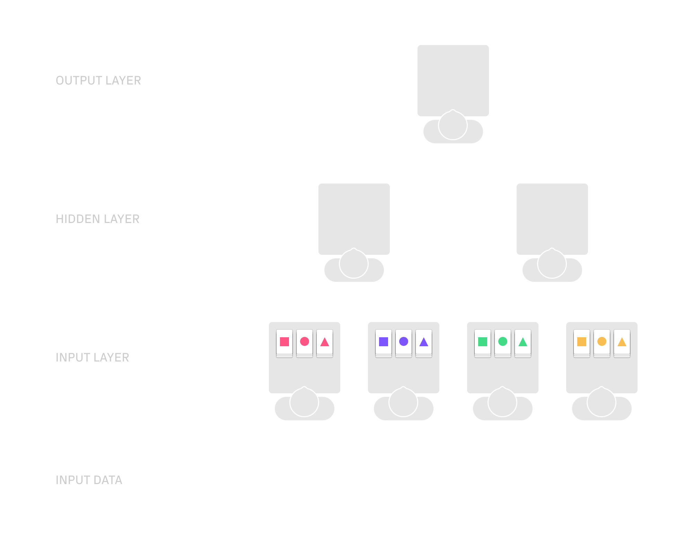
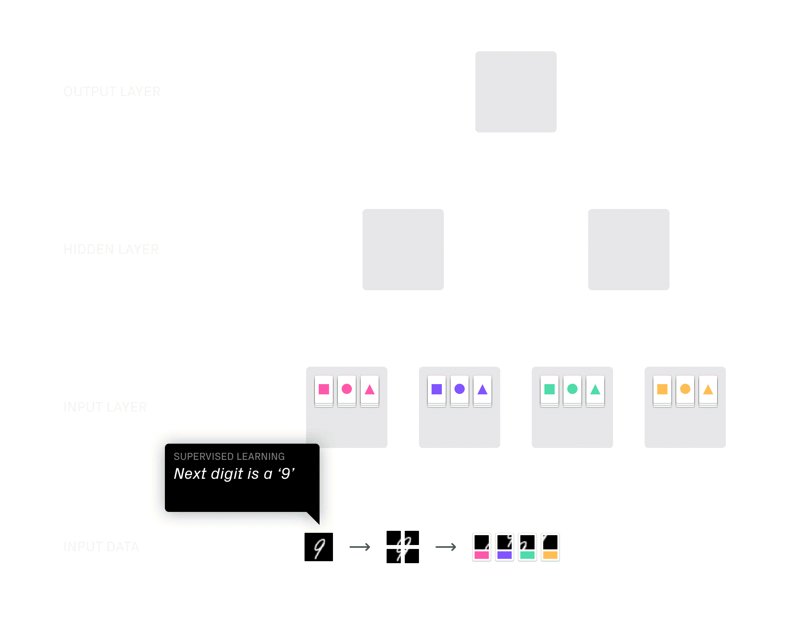
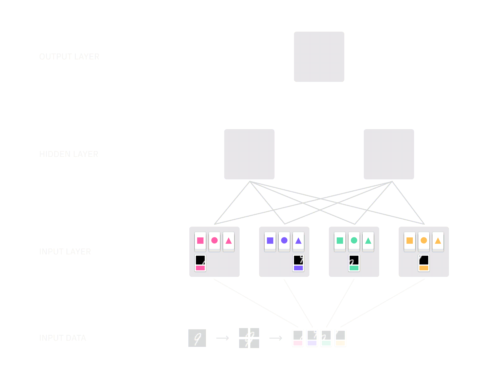
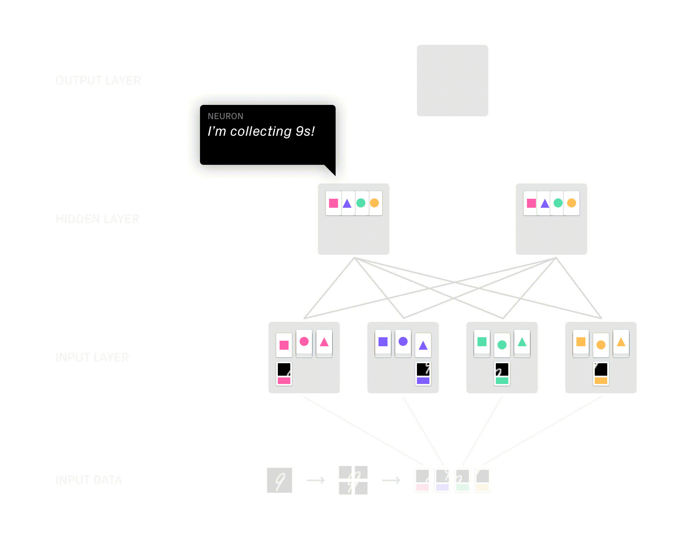
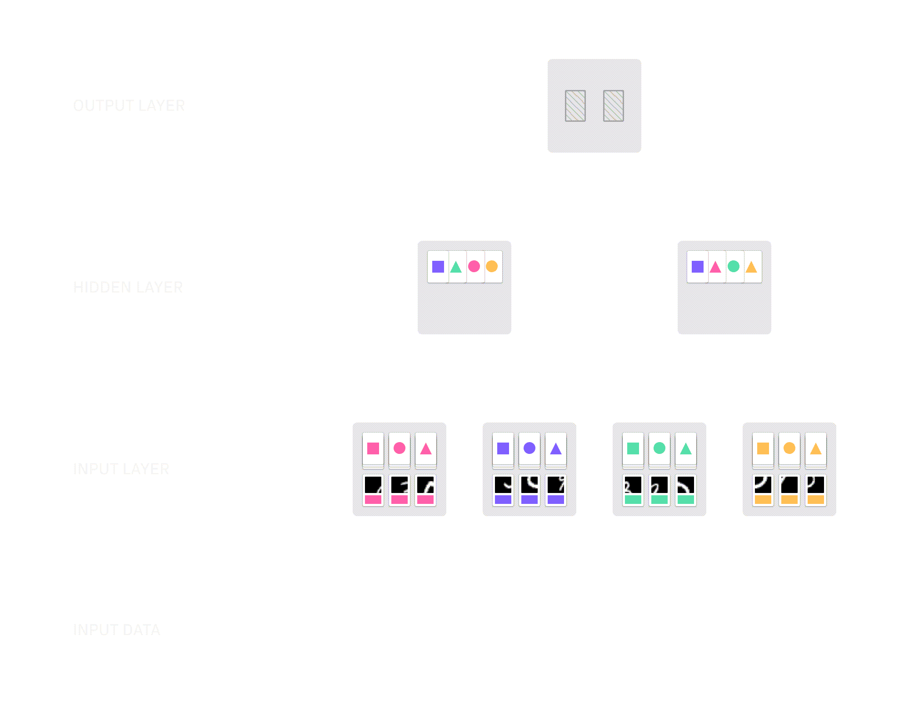

# embodied-ml

Embodied machine learning is an educational game aimed at people trying to acquire a basic understanding of neural networks before moving on to more in-depth learning.

## Gameplay

