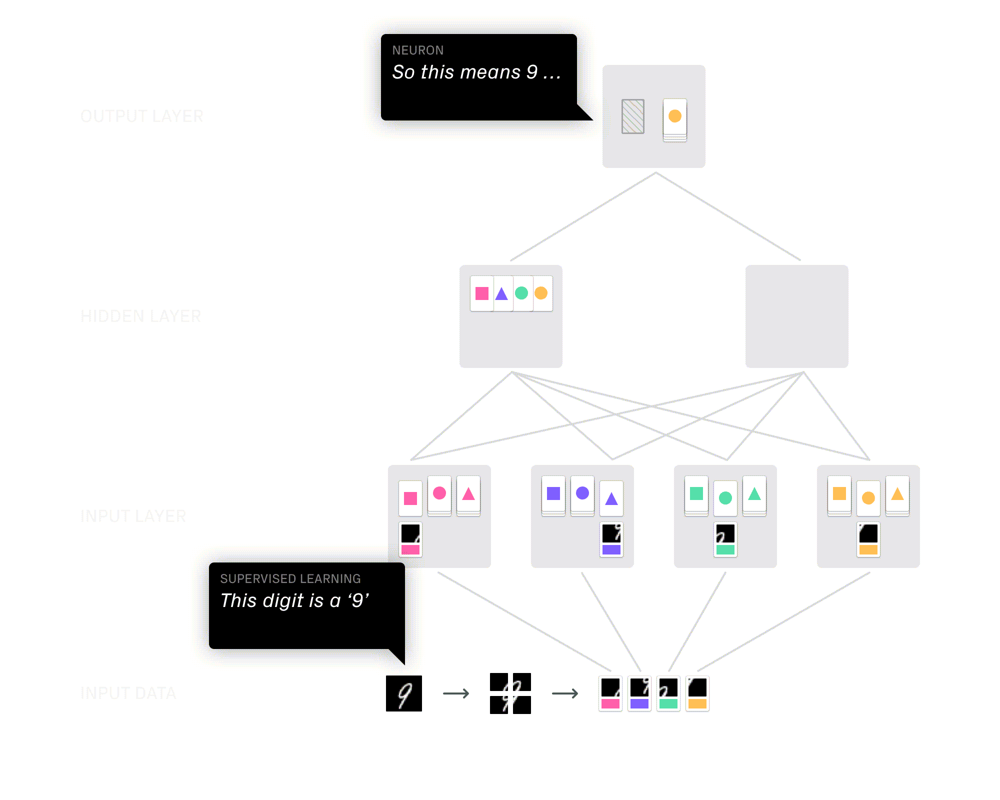
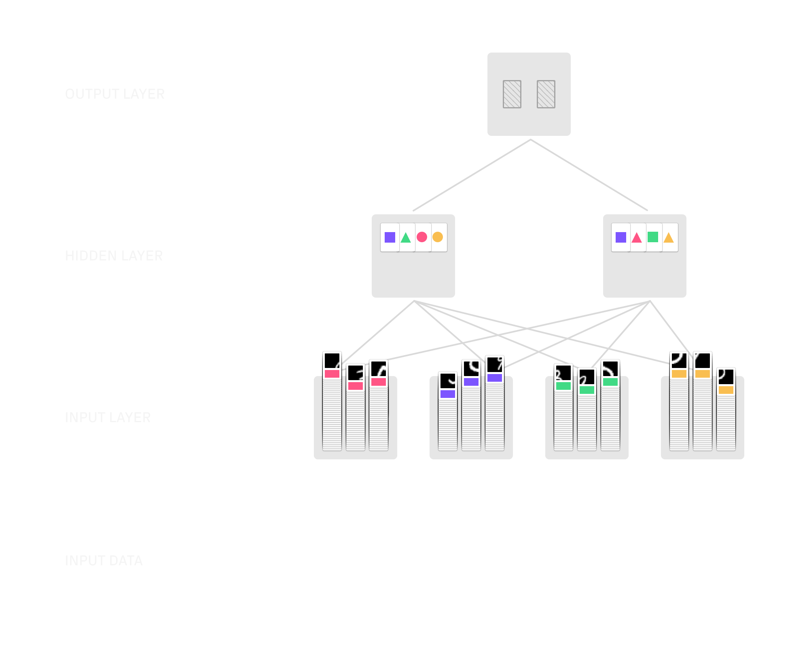

# embodied-ml

Embodied machine learning is an educational game aimed at people trying to acquire a basic understanding of neural networks before moving on to more in-depth learning.

The game refrains from involving linear algebra and tries to create understanding through metaphors, embodiment, and computational thinking. Reducing complexity requires blurring concepts or omitting them altogether. As a result, there is no 1:1 correspondence between how a neural network operates and the game mechanics. I try to strike a balance between conceptual accuracy and accessibility; not to over-simplify, but also not to complicate.

In technical terms, the game is a (human) handwritten digit classifier trained on the MNIST dataset through supervised learning. Essentially, this means: a group of people together will be able to identify handwritten digits.

Identifying handwritten digits of course comes natural to most literate people (unless, perhaps, the digit is written by a doctor) but used to be quite hard a problem for computers. While the problem is long solved [MNIST](https://en.wikipedia.org/wiki/MNIST_database), a dataset of 60.000 labelled images of handwritten digits, remains a classic benchmark for ML applications. I choose to emulate a MNIST classifier for this historic significance and to create a sense of purpose or achievement for players in my game.

*Note: This is a draft version of the game. See the Discussion section for suggestions to contribute.*

## Gameplay

The game is played in two modes, training and testing, consecutively. Players each embody one neuron in the network. The goal is for all players to work together to classify handwritten digits as accurately as possible. It can be played in various constellations of players (that will affect the network's performance) and accommodate 3 or, theoretically, hundreds or people. The game is intended for a classroom setting where the gameplay is guided by an instructor.

The game works through a series of complexity reductions where the MNIST number is reduced to simplified abstractions, until only a category (i.e. the classification of the digit) remains.
This logic is implemented through a system of colors, shapes, and the passing of cards to players in the next layer.

## Table Setup

*Note: The setup described in this repository is intended for a group of 5-7 players. As mentioned before, other group sizes work, too, but you will need to create new MNIST [data cards](resources/cards.indd).*

1. Print the [shape cards and data cards](resources/cards.pdf) on US Letter sized paper as duplex.
2. Cut each sheet into eight equal size cards. Use the dotted lines as guides.
3. Arrange all [training cards](assets/print-sheet-data.png) (the ones with the black squares) in a stack. Each card has on its back two numbers. Make sure that always four consecutive cards have the same back.
4. Setup the game room in a seating arrangement like in the image below and distribute the [shape cards](assets/print-sheet-shapes.png) to each player in the third row. Rows are called layers now.
	

# Let's play!

## 1. Training

Let's play! First, we have to train the *neural network* (i.e. our group of players) to be able to recognize digits.
Instead of going around the table like in traditional card games, we're playing row by row or layer by layer (This is called *feed forward*).

### 1.1 Input Layer
Each neuron (i.e. player) in this layer draws one data card from the deck that has their color on it. Look at the black square with some white in it. What is characteristic about it? Is there a loop, a circle, or no white at all? What do you think will help you identify other handwritten examples of the same number? We call these hints *features*.
 
Turn the card around. The top number (without the brackets) is the ‘value’ of the handwritten number you're trying to classify. Use your shape cards as categories and assign the number to a shape, e.g. '9 = square'.

*Note: every player should choose their own category. Neurons are not allowed to talk to each other*

### 2.2 Hidden Layer
Each neuron in the hidden layer asks each neuron in the input layer for a category card (e.g. 'triangle') for the current digit. Afterwards, they each have four cards in four colors on their table. 

These cards are like a code. For example, 'red rectangle + blue triangle + green circle + yellow circle means: digit is 9'. You might think this is complicated, but actually it is way fewer information (from a computer's perspective) than what was in the original image.

Neurons in the hidden layer pick a digit that will be their own digit. We know that this round is training a 9. So one neuron in the hidden layer decides to collect 9s and keeps the four cards to be able to remember which code means 9. The other neuron discards their stack of cards to the neuron in the output layer.

*Note 1: As soon as another digit is classified, the other neuron will keep that stack of cards (which will have a different code).*

*Note 2: Over time, the code will vary. Swap and rearrange cards in your deck. Observe the changes and whose cards are more consistent and useful to you. Place more weight on these neurons.*

### 2.3 Output Layer

This final neuron can only get two possible inputs: either one of the neurons in the hidden layer can hand their stack of cards over. All it has to do is to remember, for example: ‘neuron A gives me cards means 9; neuron B gives me cards means 3'. That way, we can even identify a third number: 'both neurons give their cards means something else.'. The concept of getting something (cards) and translating it to an output ('it's a 9!') is called *activation function*.

The output neuron will get things right or wrong and, ideally, improve its performance over the course of the game. Since all previous neurons (input and hidden layer) can observe the performance of the output neuron they can adjust their own strategy accordingly, for example by focussing on other features on their data card. The process of adjusting neuron's behavior based on the network's overall performance is called *back propagation*.

### 2.4 Training

Here is how three rounds would look like:

In order to be able to classify numbers more accurately we need to play multiple rounds. We need to look at many examples of handwritten 3s to be able to determine what they all have in common. This is called *training*. Generally, the longer we train, the more accurate the results. I recommend at least three rounds.

MNIST has a total of 60,000 examples to train with. So the limit, really, is not the data but your own determination:

## 2. Testing

Finally, let's test how good we perform with handwritten numbers that we haven't seen before and where we don't know from the start which digit it is.

The gameplay is similar to the training process. 

1. Each neuron in the input layer receives a card, but does *not* look at the back this time. Rather, it compares the image to its representation images and assigns it to a category.
2. The neurons in the hidden layer receive category cards from the first layer. They each compare this code to their card deck and decide if they're confident the number is what they've been trained for. If the number is not their digit, they pass on the whole stack to the output layer
3. The neuron in the output layer receives one or two stacks of cards and calls out which digit we're looking at based on knowledge acquired during the training.
4. The neurons in the input layer flip over the input card and check if the guess was correct.
5. *Optional: keep a list of correct and wrong guesses and calculate your accuracy. Computers achieve accuracy rates in the high 90% range. Keep training!*

## Evaluation & Discussion

AI-explainability is an increasingly important research area, but its outcomes, from my observation, often don't target concerned citizens outside of data science. The fetishization of AI in the media — where articles about machine learning are frequently illustrated with a picture of 2001: A Space Odyssey's HAL 9000 or the Terminator — is symptomatic for a lack of understanding among the general public.

Embodied ML is an experiment of introducing neural networks in a non-technical way. The goal is to provide an introduction for people who  will eventually learn machine learning hands-on and, perhaps more importantly, for those who won't. 

So far, Embodied ML has been tested only in informal play tests with emphasis on the mechanical nature of the game. From observation, players grasp the instructions and gameplay but need to be guided through the process by an instructor. Frequently, players were confused about how the mechanism would work at first, but through playing the game understood the process. Players reportedly enjoyed the activity but it seems unlikely that this activity would be played outside of a classroom or other learning environment, especially due to the demanding seating arrangement and number of players.

Evaluation of the game's approach is complicated. It is unclear how useful the game is to prepare students for more technical studies in machine learning. As with many educational games, effectivity is hard to measure and calls for more precise testing instruments and procedures outside of the scope of this project. 

In the words of James Paul Gee, games are excellent tools for preparing for future learning [1]. My hope is that Embodied ML helps players get a basic understanding of neural networks and helps them with further learning or becoming better-informed citizens.

---

[1] James Gee. (2010). *Game Design = Learning Design = Game Design*. Foundations of Digital Games, Monterey, CA.